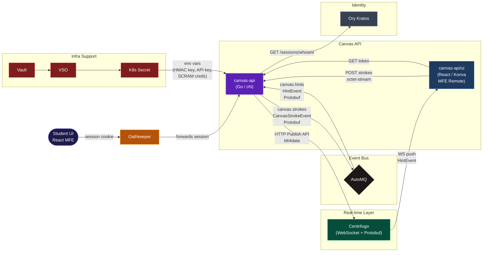

# canvas-api

[](https://github.com/MathTrail/canvas-api/actions)
[](https://github.com/MathTrail/canvas-api/releases)
[](https://github.com/MathTrail/canvas-api/blob/main/go.mod)
[](https://goreportcard.com/report/github.com/MathTrail/canvas-api)

Canvas API is the real-time drawing and feedback service of the MathTrail platform. Students solve math problems by writing with a stylus on an interactive canvas — the service streams strokes to the event bus and delivers AI-generated hints back to the canvas in real time via WebSocket.

## Business Capabilities

- **Stroke Ingestion** — Receives stylus input (pen pressure, coordinates) from the browser and publishes strokes to AutoMQ for downstream AI analysis.
- **Real-time Hints** — Consumes AI-generated hint events and pushes them instantly to the student's canvas via Centrifugo WebSocket.
- **Secure Sessions** — Issues scoped Centrifugo JWT tokens bound to the student's Ory session, preventing channel spoofing.
- **Interactive Canvas UI** — Ships a Vite Module Federation Remote (React + Konva) consumed by the `ui-web` shell: task text on a protected read-only layer, drawing on a separate erasable layer, hint overlays on a third layer.

## System Architecture

[](https://www.automq.com/)
[](https://centrifugal.dev/)
[](https://protobuf.dev/)

[](https://aws.amazon.com/event-driven-architecture/)
[](./infra/helm/canvas-api)
[](https://www.vaultproject.io/)



### Canvas Layers

The React UI uses a three-layer Konva Stage so that erasing never touches the task text:

```
┌─────────────────────────────────┐
│  Layer 3 — HintLayer            │  listening=false  server hint overlays
│  Layer 2 — DrawingLayer         │  listening=true   pen strokes + eraser
│  Layer 1 — TaskLayer            │  listening=false  task text (read-only)
└─────────────────────────────────┘
```

Each Konva layer is a separate DOM `<canvas>` element. The eraser uses `globalCompositeOperation: "destination-out"` which acts only within the DrawingLayer canvas, leaving the TaskLayer untouched.

## Development

All commands are run via `just`.

```bash
just first-build     # seed k3d registry before first skaffold run
just dev             # skaffold dev — hot-reload + port-forward :8080

cd ui && npm install
cd ui && npm run dev  # MFE dev server on :3001
```

## Debug

[Telepresence](https://www.telepresence.io/) intercepts live cluster traffic and routes it to your local process. `--mapped-namespaces all` ensures that `kratos.identity.svc` and `automq.streaming.svc` DNS names resolve correctly in the local environment.

```bash
just tp-intercept
go run ./cmd/server

just tp-stop
```

## Releases

```bash
git tag -a v0.1.0 -m "Release description"
git push origin v0.1.0
```

GitHub Actions will build binaries, generate a Changelog, and publish a GitHub Release.
