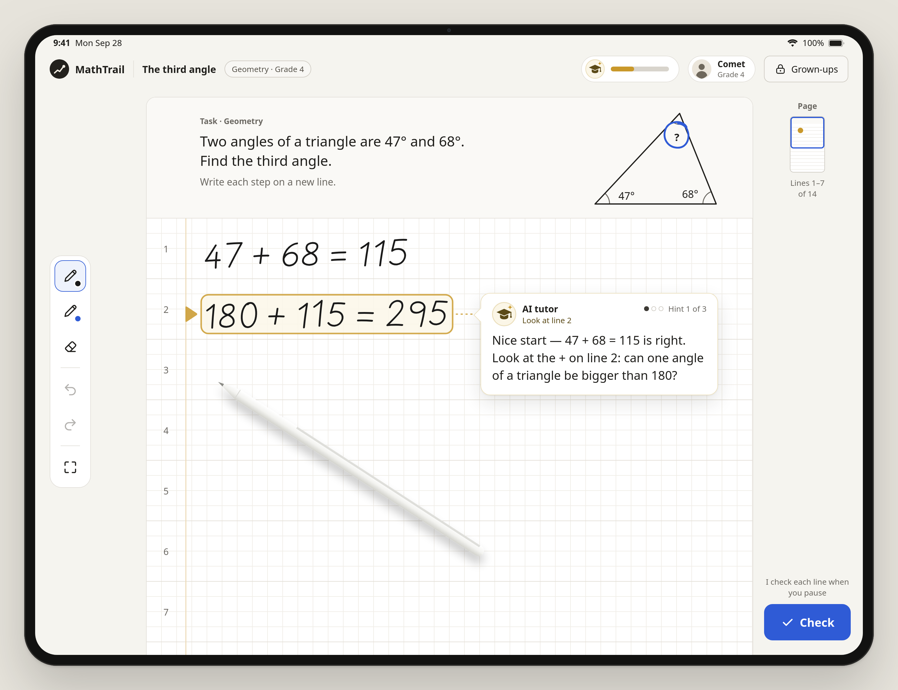
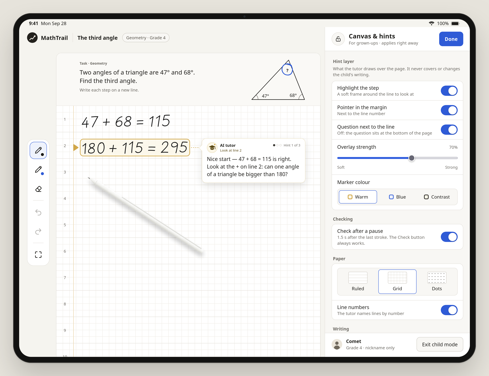
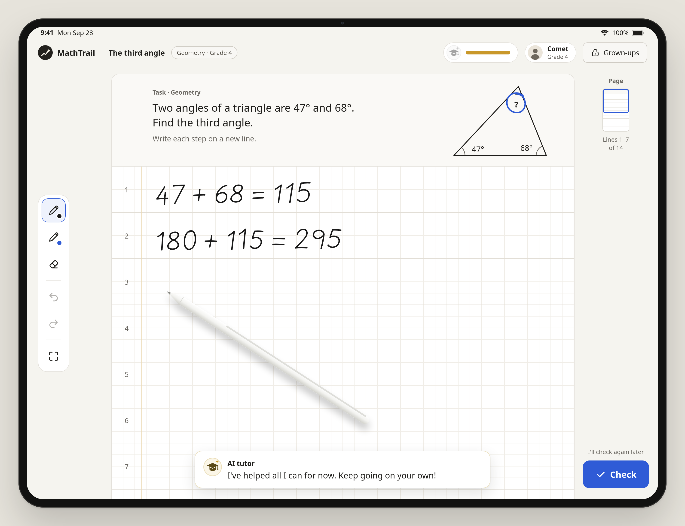
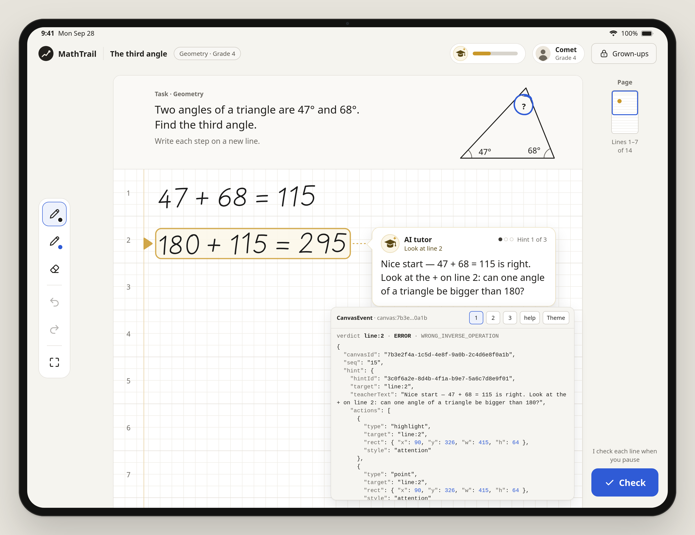

# MathTrail Canvas

MathTrail Canvas is a math tutor for children in grades 1–6. A child solves a problem by hand, with a stylus or a finger, on a virtual sheet of paper. The service checks every step of the solution. When it finds a mistake, it does not give the answer: it highlights the spot and asks a short guiding question.

<picture>
  <source media="(prefers-color-scheme: dark)" srcset="draft/ui/screens/hint-dark.png">
  
</picture>

What the child sees on the canvas:

- **Task layer.** The condition sits at the top of the page and never changes.
- **The child's ink.** Each step goes on its own ruled line. Line 1 is right, so the tutor stays silent.
- **Hint layer.** Line 2 uses the wrong operation. The AI tutor frames that line, points to it in the margin and asks one guiding question in a speech bubble. It never shows the answer and never covers the child's writing. If the child makes the same mistake again, the hints get more specific (up to three), and then the tutor suggests asking a grown-up.
- **The tutor's help.** The bar next to the tutor's icon in the top bar fills up as the day's help is used. The child sees no numbers and no prices.

This is a design mockup. The geometry task is only an example: the MVP ships with one equation and one arrow-matching task.

### Grown-up settings and the plan

<picture>
  <source media="(prefers-color-scheme: dark)" srcset="draft/ui/screens/settings-dark.png">
  
</picture>

Child mode has no settings of its own. A grown-up opens this panel with their PIN, and every change shows up on the page right away. The panel starts with the plan and the same help bar, this time with the share used. Plans come after the free beta ([docs/product.md](docs/product.md), section 14, in Russian): free; $10 a month for bigger daily quotas; $20 a month for even bigger quotas and an AI tutor with a voice. The mockup shows the first two, and their quotas are placeholders.

### When the day's help runs out

<picture>
  <source media="(prefers-color-scheme: dark)" srcset="draft/ui/screens/resting-dark.png">
  
</picture>

When the bar is full, nothing is checked until the day's help renews: no frames, no questions, no congratulations. The child keeps writing and can finish the task alone. The tutor says so once, and again if the child presses Check.

### Under the hood

<picture>
  <source media="(prefers-color-scheme: dark)" srcset="draft/ui/screens/events-dark.png">
  
</picture>

What the client receives on the realtime channel `canvas:{canvas_id}` is a `hint` event. Its `highlight` and `point` actions carry a `rect` in logical page units: the page is 1000 units wide, so the frame lands on the same strokes on any screen. The event format is in [docs/spec.md](docs/spec.md) (in Russian).

To try the interactive mockup, open [draft/ui/index.html](draft/ui/index.html) in a browser. You can write with the pen, erase whole strokes and open **Grown-ups** with any 4 digits. Press `d` for the event inspector, `q` to fill the help bar and `p` to switch the plan.

## Documents

The documents are in Russian.

- [docs/product.md](docs/product.md) — what we build and why: the scope of the MVP, scenarios, unit economics, metrics and acceptance criteria.
- [docs/spec.md](docs/spec.md) — how it is built: architecture, the canvas model, the checking engine, the AI tutor, the API, data, security and deployment.
- [docs/privacy.md](docs/privacy.md) — children's data: what is collected and kept, what the external AI services receive, parental consent, deletion and retention.
- [docs/decisions.md](docs/decisions.md) — the decision log: what was decided, why, and what was rejected.
- [RUN.md](RUN.md) — the implementation plan: small tasks, run and reviewed one at a time.

## Development

All development happens in the devcontainer; nothing but Docker and VS Code is needed on the host.

1. Install Docker and VS Code with the Dev Containers extension.
2. Open the repository — on Windows, from WSL — and choose "Reopen in Container". The first build downloads the pinned toolchain and takes a few minutes.
3. `just --list` shows the available recipes.

The environment, its pinned versions and how to change one are described in [CLAUDE.md](CLAUDE.md#environment).
