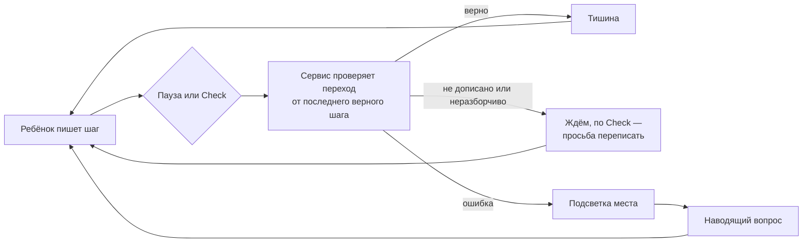

# MathTrail Canvas — продуктовый документ (MVP)

> Статус: черновик для обсуждения, 2026-09-27. Собран из исходного черновика автора (в репозиторий не входит) и решений обсуждения 2026-09-27 ([decisions.md](decisions.md)); исправлен по итогам ревью документов.
>
> Документ описывает, что мы строим и зачем: ценность, границы MVP, сценарии, экономику и метрики. Техническое устройство описано в [spec.md](spec.md), данные детей и законы — в [privacy.md](privacy.md). Открытые вопросы собраны в разделе 15.
>
> Название «MathTrail Canvas» рабочее (О-9). `canvas-api` — имя сервиса, а не продукта.

## 1. Суть продукта

**Что это.** Интерактивный репетитор по математике для детей 1–6 классов (6–12 лет). Ребёнок решает задачу стилусом или пальцем на виртуальном листе, как в обычной тетради. После каждого шага сервис проверяет его рассуждение.

**Главная идея.** Вместо тестов с вариантами ответа и ввода с клавиатуры ребёнок пишет от руки. Проверяется не только ответ, но и каждый промежуточный шаг. Найдя ошибку, наставник не даёт готового ответа. Он подсвечивает место ошибки прямо поверх записи ребёнка и задаёт короткий наводящий вопрос — это метод Сократа.

**Чем отличается от обычного тренажёра:**
- видит ход решения, а не только ответ, и находит ошибку на том шаге, где она случилась;
- не исправляет за ребёнка, а спрашивает так, чтобы он нашёл ошибку сам;
- не мешает, пока всё верно: верный шаг проходит без комментариев.

## 2. Проблема и ценность

**Проблема.** Ребёнок, который решает дома, узнаёт об ошибке поздно — когда проверят ответ. Где именно он ошибся, он часто не понимает. Тесты с выбором ответа приучают угадывать. Ввод формул с клавиатуры для младшеклассника — отдельная трудность. Репетитор решает эту проблему, но он дорог и доступен не каждый день.

**Для ребёнка:**
- пишет так, как привык в школе, без клавиатуры и редакторов формул;
- получает мягкую подсветку и вопрос вместо «красной ручки» и оценки;
- учится находить ошибку сам, а не получает правильный ответ.

**Для родителя:**
- доступная замена части занятий с репетитором (в MVP бесплатно, R05);
- видно, на каком шаге ребёнок ошибается и какие ошибки повторяются;
- о ребёнке хранится минимум: псевдоним и класс, без имени, фото и контактов (раздел 11).

**Для школ и образовательных центров — после MVP.** Автоматическая проверка хода решения и сводка частых ошибок группы. В MVP этого нет (R06), но архитектура это учитывает.

## 3. Аудитория и рынок

- **Ребёнок** 6–12 лет, 1–6 класс. Решает задачи на холсте в детском режиме.
- **Родитель или опекун** — владелец аккаунта. Входит через Google или Apple, даёт согласие на обработку данных ребёнка, создаёт профили детей, видит прогресс и удаляет данные. Субъект доступа в системе — всегда он (R07).
- **Рынок** — международный. Интерфейс и подсказки на английском (R02). Правовые режимы: COPPA, GDPR, UK GDPR с Age Appropriate Design Code. 152-ФЗ вне рамок ([privacy.md](privacy.md), раздел 2).
- **Устройства:**
  - в первую очередь планшет со стилусом или пальцем: iPad с Apple Pencil в Safari, Android-планшеты в Chrome;
  - десктоп с мышью поддерживается, но он вторичен;
  - телефон — по возможности: экран мал для письма.
- **Запуск** — закрытая бесплатная бета по инвайт-кодам (О-11). Пока нет DPIA и договоров с обработчиками, в бете участвуют только семьи из США (П-2, П-3).

## 4. Место в экосистеме MathTrail

- MathTrail — семейство продуктов для школьной и олимпиадной математики. Рядом уже есть mathtrail-standalone — бесплатное приложение для Claude и ChatGPT. Там модель чата пишет олимпиадные задачи с выбором ответа A–E, а сервис их проверяет.
- MathTrail Canvas — отдельный продукт с другой механикой: рукописное решение и проверка хода решения. Бренд общий, аккаунты и данные — нет.
- MVP работает на управляемых сервисах GCP, без k8s и EDA (R01). Так быстрее выйти на рынок и дешевле держать инфраструктуру.
- Платформа MathTrail на k8s + EDA — путь развития при росте нагрузки. В неё входят identity на Ory, Kafka, Centrifugo в infra-streaming и контракты `canvas.v1` ([spec.md](spec.md), раздел 19).

## 5. Механики

### 5.1. Трёхслойный холст

1. **Слой задачи** — условие, неизменное. Для пути А это уравнение или выражение, для пути Б — объекты (картинки, кружки), которые нужно соединить.
2. **Слой ученика** — свободное поле с линовкой, как в тетради. Ребёнок пишет, рисует, стирает. Ластик убирает штрих целиком.
3. **Слой подсказок** — прозрачный слой наставника: подсветка, указатели, текст подсказки. Он никогда не меняет и не закрывает запись ребёнка.

### 5.2. Что такое шаг и когда запускается проверка

- В пути А шаг — одна строка. Каждый шаг пишется с новой строки, об этом сказано в условии: «Write each step on a new line».
- Проверка запускается после паузы 1,5–2 секунды или по кнопке **Check**.
- Незаконченная строка вроде `2x = 11 −` ошибкой не считается: пауза посреди мысли — это нормально.
- В пути Б шаг — новая стрелка. Проверка запускается так же: по паузе или кнопке.

### 5.3. Педагогический цикл

1. Ребёнок пишет очередной шаг.
2. Сервис проверяет переход от последнего верного шага к новому:
   - шаг верный — тишина (О-15);
   - строка ещё пишется — сервис ждёт: ошибку в недописанной строке не показывает, даже если начало строки выглядит законченным (`2x = 11` перед `− 5`). Строка считается законченной, когда ребёнок перешёл к другой строке, нажал Check или 6 секунд не трогал холст;
   - строка неразборчива — сервис молчит; по Check просит переписать её аккуратнее, а недописанную — дописать;
   - ошибка — сервис определяет её тип: знак не изменён при переносе, ошибка вычисления, не та обратная операция, неверно переписано условие, неверная связь на схеме.
3. Сократовское вмешательство. Сразу появляется мягкая подсветка места — строки или стрелки. Следом — один короткий наводящий вопрос.
4. Ребёнок исправляет: стирает и пишет заново. Цикл повторяется.



После отмеченной ошибки следующие строки, выведенные из неё, повторно не отмечаются: ошибка уже показана. Но неверный финальный ответ не засчитывается.

### 5.4. Правила подсказки

- никогда не называть ответ и исправленный шаг;
- один вопрос, не больше двух коротких предложений, слова по возрасту;
- указывать на место: подсветка на слое подсказок и ссылка в тексте («Look at the +5…»);
- поддерживающий тон: без «неправильно» в лоб; начинать с того, что уже получилось;
- говорить только о математике задачи: никаких посторонних тем, ссылок и личных вопросов.

**Лестница при повторной ошибке** в том же месте (предложение, О-12). «То же место» — та же ошибка в том же члене или та же неверная пара. Ступени сохраняются, даже если ребёнок переписал строку ниже или заново нарисовал стрелку.
1. подсветка и общий вопрос о месте ошибки;
2. более конкретный вопрос о правиле: что происходит со знаком при переносе;
3. разбор похожего шага на других числах, например `3x + 4 = 10`, — без решения самой задачи.

После третьей ступени наставник предлагает позвать взрослого или начать заново. Ответ не показывается никогда.

### 5.5. Путь А и путь Б глазами ребёнка

- **Путь А — арифметика и уравнения.** Ребёнок пишет решение по строкам. Ошибочная строка подсвечивается рамкой, вопрос называет конкретный член: «the +5».
- **Путь Б — олимпиадные схемы.** Ребёнок соединяет объекты стрелками. Неверная стрелка подсвечивается, вопрос касается смысла связи: «Where does a bee live?».

### 5.6. Неразборчивый почерк и сбои

- Если почерк не распознан уверенно, по паузе сервис ждёт. По кнопке Check — вежливо просит: «Can you write this line a bit more neatly?».
- Если проверить нельзя — сбой распознавания или сбой ИИ при разборе схемы, — ребёнок видит нейтральное «I can't check right now — keep going!», а не ошибку.
- Если исчерпан дневной лимит (раздел 9), ребёнок решает дальше сам: запись сохраняется, но пока лимит не обновится, наставник молчит — ни подсветки, ни вопросов, ни поздравления. Об этом он говорит один раз: «I've helped all I can for now. Keep going on your own!» (R35).
- Если ошибка уже найдена, но ИИ не смог сформулировать вопрос, ребёнок получает заготовленный наводящий вопрос.
- Если распознавание не уверено, ошибка не показывается: промолчать лучше. **Ложная ошибка хуже, чем отсутствие проверки.**
- Если ребёнок исправил строку, подсветка и вопрос исчезают.

### 5.7. Завершение задачи

- **Путь А:** последняя строка имеет вид `x = 3` и совпадает с ответом.
- **Путь Б:** все пары соединены верно.
- Ребёнок видит короткое поздравление и анимацию. Затем предлагается вторая задача или «решить заново» с чистым листом (О-16).

## 6. Сценарии MVP

**С1. Первый вход.**
1. Родитель открывает приложение и входит через Google или Apple.
2. Вводит инвайт-код беты (О-11).
3. Видит короткое уведомление о данных: что собираем, кому передаём, как удалить. Отмечает, что прочитал, и отправляет подписанную форму согласия. Пока оператор её не подтвердил, профиль ребёнка создать нельзя: так работает проверяемое согласие (П-1, R26).
4. После подтверждения создаёт профиль ребёнка: псевдоним (форма подсказывает не вводить настоящее имя), аватар из набора, класс.
5. Задаёт PIN детского режима.

**С2. Детский режим.** Родитель выбирает профиль и передаёт устройство ребёнку. Ребёнок видит только задачи и холст. Выход в родительский раздел закрыт PIN.

**С3. Задача пути А.**
1. Ребёнок видит условие `2x + 5 = 11` и пишет решение по строкам. Верные шаги проходят молча.
2. На строке `2x = 11 + 5` строка мягко подсвечивается, следом появляется вопрос.
3. Ребёнок стирает строку и пишет `2x = 11 − 5`, затем `2x = 6` и `x = 3`.
4. Поздравление.

**С4. Задача пути Б.** Ребёнок соединяет стрелками пары «животное — его дом». Неверная стрелка подсвечивается, наставник спрашивает о смысле связи. Когда все пары верны — поздравление.

**С5. Неразборчиво или сбой.** Поведение описано в разделе 5.6.

**С6. Прогресс для родителя.** Минимум (О-14): какие задачи начаты и решены, сколько было подсказок, какие типы ошибок встречались, когда было последнее занятие.

**С7. Удаление.** Родитель удаляет профиль ребёнка со всем, что с ним связано, или весь аккаунт. Подтверждение — повторный вход: PIN для этого недостаточно, ведь ребёнок может его подсмотреть. Сроки полного удаления, включая резервные копии, — в [privacy.md](privacy.md), раздел 7.

**С8. Доступ в бету.** Войти может только родитель с одноразовым инвайт-кодом (О-11). Код не привязан к email, поэтому работает и с Apple «Hide My Email». Без кода — лист ожидания.

## 7. Объём MVP

**Входит:**
- веб-приложение для планшетов и десктопа с интерфейсом на английском;
- вход родителя через Google или Apple, инвайт-код, подтверждённое оператором согласие, несколько профилей детей (лимит — О-13);
- детский режим с PIN;
- две статичные задачи: одна для пути А, одна для пути Б (R04, О-10);
- проверка шагов: распознавание рукописных строк, детерминированная проверка, подсказки ИИ;
- слой подсказок: подсветка строки или стрелки и текст вопроса;
- доставка подсказок в реальном времени;
- минимальный экран прогресса для родителя;
- удаление профиля ребёнка и аккаунта;
- дневные лимиты на ребёнка, закрытая бета по приглашениям.

**Не входит:**
- оплата и подписка (R05);
- учителя, классы, школы, групповая аналитика (R06);
- каталог задач, их подбор, адаптивная сложность (R04);
- собственный вход ребёнка со своего устройства (R07);
- нативные приложения для iOS и Android;
- голос и видео, в том числе Gemini Live;
- языки, кроме английского;
- офлайн-режим;
- 7 класс и старше;
- чат с ИИ и любой свободный ввод текста ребёнком.

## 8. UX-принципы для детей

- **Никакой «красной ручки».** Ошибка подсвечивается мягким цветом, без крестиков и оценок.
- **Без давления.** Нет таймеров, очков за скорость и соревнований.
- **Коротко.** Подсказка — не больше двух предложений. Для младших задач слова проще.
- **Удобный ввод.** Крупные кнопки и области касания. Работа пальцем и стилусом; стилус в приоритете, касание ладонью игнорируется.
- **Запись ребёнка неприкосновенна.** Наставник только подсвечивает поверх неё.
- **Тишина, пока всё верно.** Реакция появляется только тогда, когда она нужна.
- **Ничего лишнего.** Нет внешних ссылок, рекламы и «тёмных паттернов» (UK AADC, [privacy.md](privacy.md)).

## 9. Юнит-экономика

**Из чего складывается стоимость:**
- **распознавание рукописной строки** — Mathpix, $0.002 за запрос, при объёме больше 1 млн запросов — $0.0015. Разовая активация $19.99, стартовый кредит $29;
- **текст подсказки** — Gemini Flash-Lite, доли цента за вызов;
- **разбор схемы по картинке** — Gemini Flash; только путь Б и только неоднозначные случаи;
- **инфраструктура** — Cloud Run, Neon, Upstash, Firebase; на объёмах беты укладываются в бесплатные лимиты.

```
стоимость задачи ≈ N_распознаваний × $0.002 + N_подсказок × C_текст + N_картинок × C_vision + инфраструктура
```

**Оценка на задачах MVP.** Допущения — гипотезы, они проверяются в бете.

| Статья | Цена единицы | Задача А (`2x + 5 = 11`) | Задача Б (стрелки) |
|---|---|---|---|
| Mathpix | $0.002 за запрос | ~8 запросов (4 строки × 2 проверки) → $0.016 | не нужен |
| Gemini Flash-Lite, текст | ~$0.001 за вызов | 1–2 подсказки → ~$0.002 | 1 подсказка → ~$0.001 |
| Gemini Flash, картинка | ~$0.004 за вызов (цены до 31.12.2026) | — | 0–1 вызов → до $0.004 |
| Инфраструктура | бесплатные лимиты | ~0 | ~0 |
| **Итого** | | **≈ $0.02** | **≈ $0.001–0.005** |

Как получены цены вызовов:
- **Flash-Lite:** Gemini 3.5 Flash-Lite, $0.30 за 1 млн входных токенов и $2.50 за 1 млн выходных. Около 1 200 входных и 300 выходных токенов с учётом размышлений — ≈ $0.001.
- **Flash:** Gemini 3.8 Flash, $0.75 и $3.75 до 31.12.2026, с 01.01.2027 — $1.50 и $7.50. Около 1 900 входных токенов (картинка ≈ 1 000) и 700 выходных — ≈ $0.004, с 2027 года ≈ $0.008.

**Выводы:**
- **Оценка черновика сходится, но структура другая.** Занятие из двух задач стоит ≈ $0.02–0.03, как и в черновике ($0.03). Но 70–80% стоимости даёт распознавание Mathpix, а не LLM.
- **Главный рычаг — число запросов к Mathpix.** Распознаём только изменившиеся строки и не распознаём строку повторно без изменений. Можно распознавать строку, только когда ребёнок перешёл на следующую или нажал Check. Так дешевле, но реакция медленнее; решается по данным беты.
- **Довод черновика ослаб.** Черновик считал, что «умная маршрутизация экономит на LLM». При текущих ценах распознать строку картинкой через Gemini Flash-Lite дешевле, чем через Mathpix. Выбор Mathpix держится на качестве распознавания детского почерка и на скорости; это проверяет спайк S1 (R19, [spec.md](spec.md), раздел 20).
- **Путь Б подорожает с 2027 года.** С 01.01.2027 цены Gemini 3.8 Flash удваиваются. Но в задаче Б картинка нужна только для неоднозначных рисунков (R21).
- **Инфраструктура в бете почти бесплатна.** Бесплатные лимиты: Cloud Run — 2 млн запросов, 180 000 vCPU-секунд и 360 000 ГиБ-секунд в месяц; Neon — 0,5 ГБ и 100 CU-часов; Upstash — 500 тыс. команд; Firebase Auth — 50 000 активных пользователей в месяц. Лимиты Google Cloud общие на платёжный аккаунт: их делят все его проекты. В MVP у canvas-api одна среда — prod (R32). Вторая среда после MVP будет делить с ней эти лимиты, а её секреты целиком выйдут за бесплатный лимит (расчёт — [spec.md](spec.md), раздел 13). Первый кандидат на расходы — Centrifugo: пока открыт хотя бы один WebSocket, инстанс Cloud Run считается активным и оплачивается ([spec.md](spec.md), раздел 14).

**Лимиты беты (О-13):**
- до 3 детей на родителя;
- до 150 распознаваний, 30 подсказок ИИ и 20 разборов схемы по картинке на ребёнка в день. В худшем случае это ≈ $0.41 на ребёнка в день, с 01.01.2027 ≈ $0.49;
- общий дневной потолок на родителя по всем детям — втрое больше детского, ≈ $1.23 в день. Он не сбрасывается, если удалить ребёнка и создать заново;
- не больше 3 новых профилей ребёнка в день;
- бюджетные оповещения GCP на проект;
- исчерпанный лимит не прерывает занятие: ребёнок решает дальше сам, без проверки (раздел 5.6, R35).

## 10. Нефункциональные требования

| Требование | Цель MVP | Как проверяем |
|---|---|---|
| Маркер ошибки после паузы или Check | ≤ 1 с (p95) | спайк S4, метрики |
| Текст подсказки | ≤ 3 с (p95) | спайк S4, метрики |
| Первый запрос после простоя (холодный старт) | ≤ 3 с | спайк S4 |
| Сохранность записи | запись ребёнка не теряется при сбое: устройство хранит штрихи, пока сервер их не подтвердил | e2e-тест с обрывом сети |
| Доступность сервиса | лучшее возможное в бете | мониторинг |
| Устройства | iPad (Safari, Apple Pencil), Android-планшет (Chrome), десктоп (Chrome, Safari, Firefox, Edge), последние версии | ручная проверка |
| Язык интерфейса | английский | — |
| Доступность для всех | контраст, крупные элементы; озвучка — после MVP | ручная проверка |

Все цели по задержке — оценки. Их подтверждает спайк S4.

## 11. Приватность и безопасность ребёнка: что обещаем родителям

- О ребёнке храним только псевдоним, аватар из набора и класс. Имени, фото, даты рождения и контактов нет.
- Аккаунт и согласие принадлежат родителю. Ребёнок не регистрируется.
- Рукописные записи и ошибки хранятся для работы сервиса и показа прогресса. Сырые штрихи — ограниченный срок ([privacy.md](privacy.md), раздел 8).
- Внешние сервисы распознавания и ИИ получают только математику: координаты штрихов, текст задачи и шагов, картинку схемы — без идентификаторов. Поставщики не обучают свои модели на этих данных ([privacy.md](privacy.md), раздел 5).
- Профиль или аккаунт удаляется в один шаг.
- Нет рекламы, продажи данных, чатов и внешних ссылок.
- ИИ говорит только о задаче, поддерживающим тоном, и не выдаёт ответ.

Честная оговорка: это псевдонимизация, а не анонимность. По GDPR такие данные остаются персональными ([privacy.md](privacy.md), раздел 1).

## 12. Метрики успеха и критерии приёмки

**Метрики беты:**

| Метрика | Определение | Цель (гипотеза) |
|---|---|---|
| **Ложные тревоги** | доля верных шагов, отмеченных как ошибка | ≤ 2% — ключевая метрика |
| Пропущенные ошибки | доля ошибочных шагов без реакции | ≤ 10% |
| Точность распознавания | доля строк, распознанных без искажения смысла | ≥ 95% на eval-наборе |
| Качество подсказок | доля подсказок, прошедших рубрику: не раскрывает ответ, один вопрос, по возрасту, по делу | ≥ 95% на ручной выборке |
| Задержка | p95 маркера и подсказки | ≤ 1 с и ≤ 3 с |
| Доведение до конца | доля начатых задач, решённых полностью | наблюдаем |
| Возврат | доля детей, вернувшихся в течение 7 дней | наблюдаем |
| Стоимость | средняя стоимость решённой задачи | ≤ $0.03 |

Откуда берутся данные:
- eval-наборы — офлайн;
- журнал шагов: распознанный LaTeX и вердикт, без персональных данных;
- ручной разбор выборки;
- сигналы родителей о ложных тревогах (О-17).

**Критерии приёмки MVP:**
1. Обе задачи решаются от начала до конца на iPad в Safari с Apple Pencil, на Android-планшете в Chrome и на десктопе.
2. На eval-наборе задачи А все эталонные ошибки находятся, а верные решения проходят без ложных тревог. Эталонные ошибки: знак при переносе, вычисление, обратная операция, переписывание условия.
3. Ни одна подсказка на eval-наборе не раскрывает ответ.
4. При недоступности Mathpix или Gemini ребёнок не видит ложной ошибки.
5. Удаление профиля и аккаунта стирает данные во всех хранилищах ([privacy.md](privacy.md), раздел 7).
6. Лимиты беты срабатывают, бюджетные оповещения настроены.
7. В журналах приложения и метриках нет персональных данных. Срок хранения журналов запросов платформы, где есть IP-адреса, задан по П-9.

## 13. Риски и гипотезы

| Риск или гипотеза | Почему важно | Что делаем |
|---|---|---|
| Детский почерк распознаётся хуже взрослого | на этом стоит весь путь А | спайк S1 на образцах; порог уверенности; просьба переписать |
| Ложные тревоги | подрывают доверие ребёнка | ключевая метрика; при сомнении — тишина; eval-набор |
| Подсказка раскрывает ответ | ломает педагогику | проверка движком; шаблоны; рубрика (R24) |
| Путь Б: vision-модель ставит рамку неточно | подсветка «не там» | детерминированный разбор (R21); спайк S2 |
| Стоимость Mathpix и WebSocket | экономика продукта | лимиты, замеры; спайк S3 |
| Жизненный цикл моделей Gemini | модели снимают примерно через год | закреплённые версии; eval-набор при смене (R22) |
| Проверяемое согласие родителя по COPPA | обязательный юридический шаг | П-1; перед публичным запуском — юрист |
| Зависимость от Mathpix | единственный поставщик распознавания | порт `Recognizer`; альтернатива — Gemini (спайк S1) |
| Детские строки «плывут» | ошибки сегментации дают ложные вердикты | линовка тетради; эвристика; Т-8 |

## 14. Дорожная карта после MVP

1. Каталог задач и подбор под ребёнка; новые темы: дроби, порядок действий, текстовые задачи.
2. Вход ребёнка со своего устройства по коду или QR от родителя (R07).
3. Учителя и классы: группы, ход решения учеников, сводка частых ошибок (R06).
4. Подписка и тарифы (R05, R36). Три тарифа:
   - бесплатный — дневная квота помощи наставника, как в бете;
   - за $10 в месяц — квоты больше;
   - за $20 в месяц — квоты ещё больше и ИИ-наставник с голосом (п. 6).

   Когда квота исчерпана, ребёнок решает дальше сам, без проверки (раздел 5.6, R35). Тариф и шкала израсходованной помощи — в макете `draft/ui/`. Размер квот и что значит «с голосом» — О-18.
5. Другие языки интерфейса и подсказок, местные способы записи (например, деление «уголком»).
6. Голосовые подсказки для младших — в тарифе за $20 (п. 4).
7. Переход на платформу MathTrail (k8s + EDA) при росте нагрузки (R01, [spec.md](spec.md), раздел 19).

## 15. Открытые вопросы

Каждый вопрос: суть, варианты, рекомендация и что он блокирует. Номера не меняются: решённые вопросы переезжают в 15.1. Новые вопросы получают следующий номер — О-19.

### 15.1. Решено

| № | Вопрос | Решение | Дата |
|---|---|---|---|
| О-1 | Типы задач в MVP | Путь А и путь Б (R03) | 2026-09-27 |
| О-2 | Состав стека | Как в черновике (R08); OpenFGA — сайдкар (R09) | 2026-09-27 |
| О-3 | Рынок и язык интерфейса | Международный, сначала английский (R02) | 2026-09-27 |
| О-4 | Оплата в MVP | Нет, закрытая бесплатная бета (R05) | 2026-09-27 |
| О-5 | Как ребёнок попадает на холст | Устройство родителя, детский режим с PIN (R07) | 2026-09-27 |
| О-6 | Учителя в MVP | Нет, только семья (R06) | 2026-09-27 |
| О-7 | Откуда задачи | Две статичные задачи от автора (R04) | 2026-09-27 |
| О-8 | Где и на каком языке документы | `docs/`, русский (R25) | 2026-09-27 |
| О-11 | Как попасть в бету | Одноразовые инвайт-коды, не allowlist email (R29): список email ломается на Apple «Hide My Email», а хеши email в конфигурации раскрывают участников | 2026-09-27 |

### 15.2. Открыто

| № | Вопрос | Варианты | Рекомендация | Блокирует |
|---|---|---|---|---|
| О-9 | Название продукта | MathTrail Canvas; MathTrail Notebook; просто MathTrail | «MathTrail Canvas» как рабочее | домен, тексты, политику конфиденциальности |
| О-10 | Какие именно две задачи | любые две по одной на путь | А — `2x + 5 = 11` (6 класс); Б — «соедини животное с его домом» (1–2 класс) | формат задачи ([spec.md](spec.md), 8.6), eval-наборы |
| О-12 | Лестница подсказок | 2 или 3 ступени; что после последней | 3 ступени (раздел 5.4); ответ не показываем никогда | промпт, шаблоны |
| О-13 | Лимиты | число детей на родителя; распознаваний, подсказок и разборов схемы в день; потолок на родителя | 3 ребёнка; 150 распознаваний; 30 подсказок; 20 разборов схемы; на родителя — втрое больше; 3 новых профиля в день | [spec.md](spec.md), раздел 14.5 |
| О-14 | Что видит родитель | счётчики; типы ошибок; повтор записи решения | счётчики и типы ошибок; повтор — после MVP | API прогресса |
| О-15 | Отмечать ли верный шаг | тишина; едва заметная галочка | тишина, галочка только на финальном ответе; проверить на детях | интерфейс |
| О-16 | Что после решения задачи | вторая задача; решить заново; выход | предложить другую задачу и «решить заново» | интерфейс |
| О-17 | Как собирать сигналы о ложных тревогах | кнопка у подсказки; только ручной разбор | кнопка «I think I'm right» в родительском разделе и ручной разбор выборки | метрику ложных тревог |
| О-18 | Тарифы после MVP (раздел 14, п. 4): размер квот и голос в тарифе за $20 | квоты — кратные лимитам беты или по бюджету на ребёнка в месяц; голос — наставник только читает подсказки вслух или ребёнок ещё и отвечает голосом | квоты — по юнит-экономике раздела 9: худший месяц подписчика должен окупаться ценой. Подписчик — семья (R07), и при лимитах беты её худший месяц уже ≈ $37 (30 × $1.23 по потолку родителя), с 2027 года ≈ $44. Голос — только озвучка подсказок: голос ребёнка по COPPA — персональная информация, а разговора с ИИ продукт избегает (раздел 7; [privacy.md](privacy.md), раздел 10) | тарифы, уведомление для родителей |

## 16. Источники

Собрано 2026-09-27.

- Mathpix, v3/strokes — https://docs.mathpix.com/reference/post-v3-strokes
- Mathpix, цены API — https://mathpix.com/pricing/api
- Gemini, цены и ID моделей — https://ai.google.dev/gemini-api/docs/pricing
- Vertex AI, release notes (снятие Gemini 2.5 Flash 16.10.2026) — https://docs.cloud.google.com/vertex-ai/generative-ai/docs/release-notes
- Бесплатные лимиты Google Cloud — https://docs.cloud.google.com/free/docs/free-cloud-features
- Cloud Run и WebSocket — https://docs.cloud.google.com/run/docs/triggering/websockets
- Neon, тарифы — https://neon.com/pricing
- Upstash Redis, тарифы — https://upstash.com/pricing/redis
- Firebase, цены — https://firebase.google.com/pricing
- Внутренние: [decisions.md](decisions.md), [spec.md](spec.md), [privacy.md](privacy.md); продукт-сосед — `mathtrail-standalone`.
